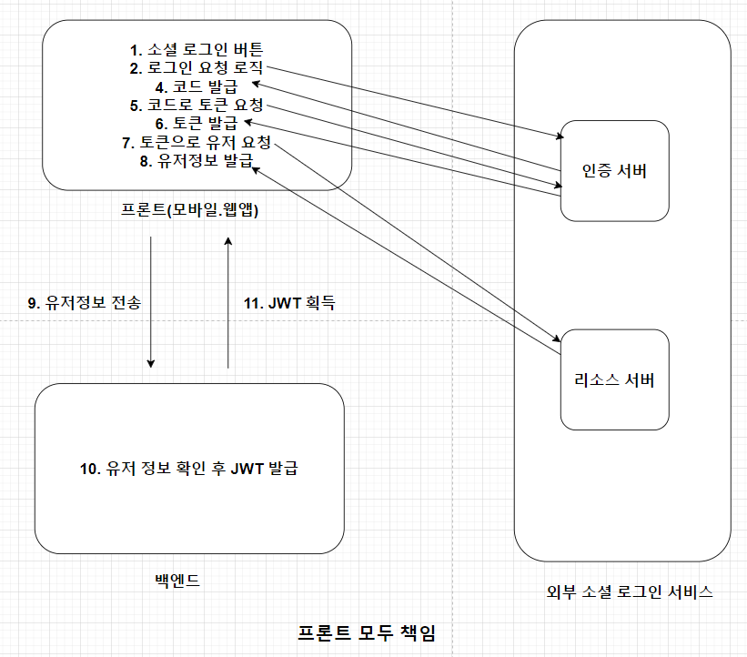
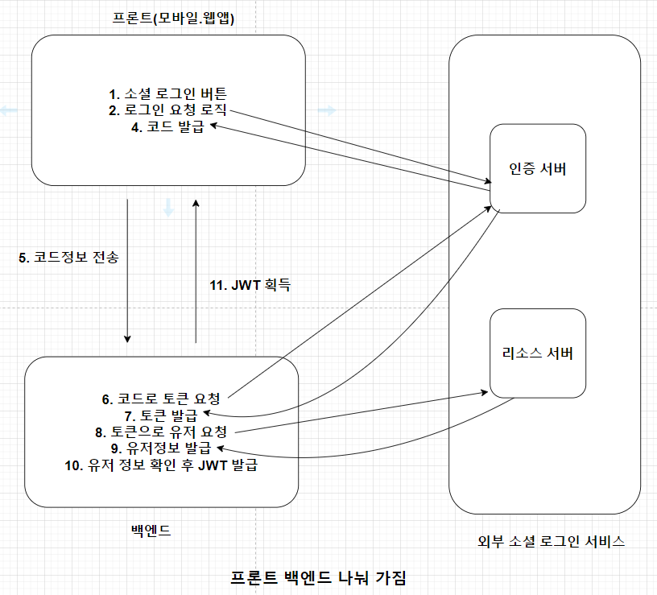
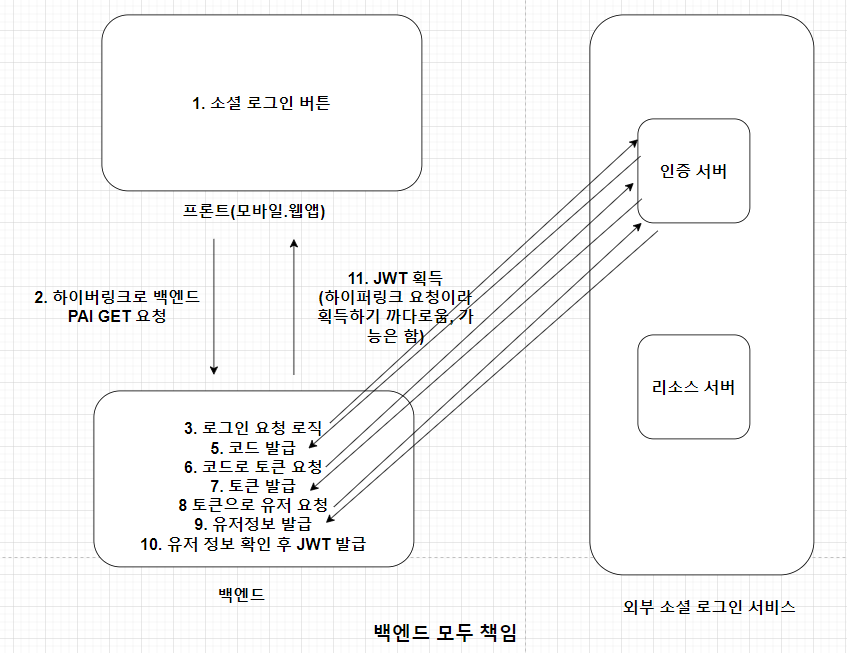
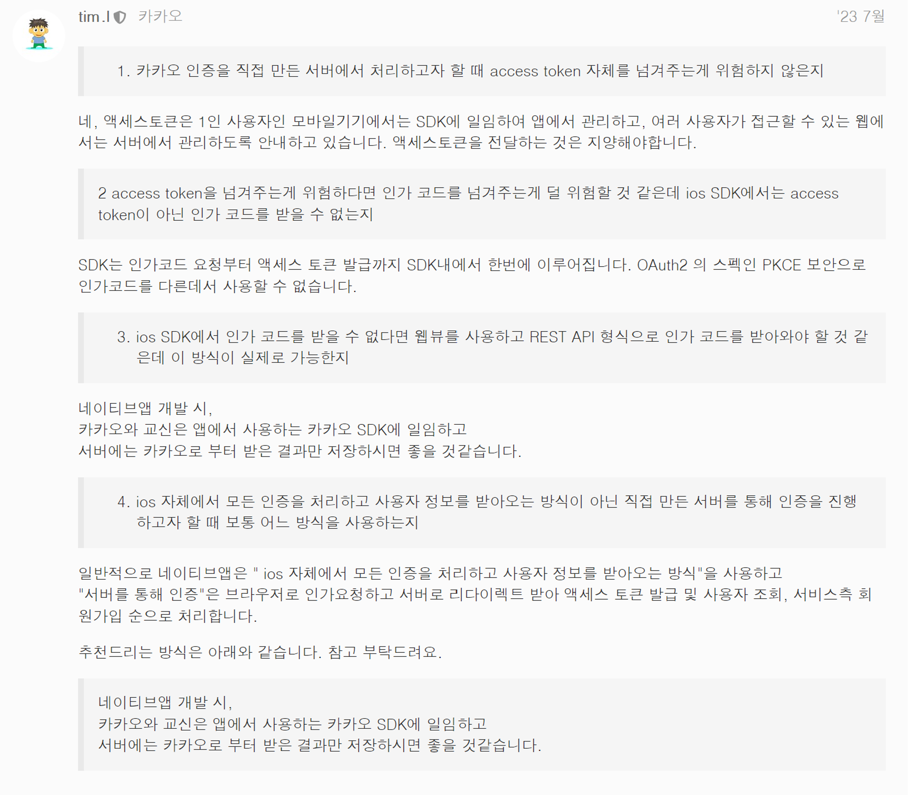
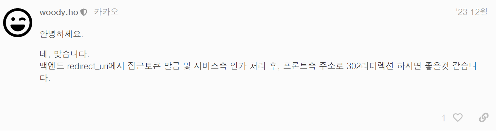
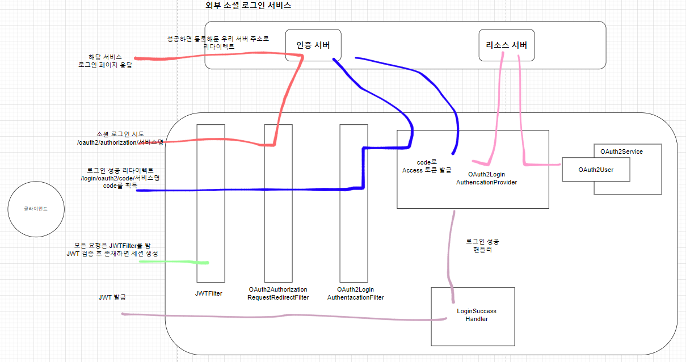
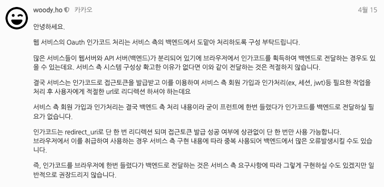

## 스프링 OAuth2 클라이언트 JWT 학습 정리

### 2장 동작 원리와 프론트/백 책임 분배
- Oauth2 Code Grant 동작 방식은 다음과 같다
1. 로그인 페이지
2. 성공 후 코드 발급 (redirect_url)
3. 코드를 통해 access 토큰 요청
4. access 토큰 발급 완료
5. access 토큰을 통해 사용자 정보 요청
6. 사용자 정보 획득 완료

#### JWT 방식에서 OAuth2 클라이언트 구성시 고민점
- JWT 방식에서 JWT 발급 문제와 웹/하이브리드/네이티브앱별 특징에 의해 Oauth2 Code Grant 방식 동작의 책임을 프론트측에 둘지 백엔드 측에 둘지 고민이 필요하다.

**JWT 발급 문제**
- 프론트엔드에서의 로그인 처리
  - 프론트에서 소셜 로그인 버튼 클릭
  - 소셜 로그인창이 열림
  - 로그인 성공 후 소셜 제공자가 redirect_url로 사용자를 리다이렉션(code 포함)
  - code 정보를 캐치하여 백엔드에 전송
  - 백엔드는 JWT를 생성하여 프론트엔드에 반환
  - 문제점은 프론트에서 하이퍼링크(redirect_url)로 실행했기 때문에 JWT를 받을 로직이 없음
  - 방법은 있음
- 백엔드에서의 로그인 처리 
  - 위 문제를 해결하기 위해 백엔드가 소셜 로그인 페이지로 사용자를 리다이렉션
  - 로그인 성공 후 리다이렉트 받은 코드를 백엔드에서 처리하여 JWT를 생성 후 클라이언트에게 반환
  - 클라이언트는 백엔드에 로그인 요청만 날림

**웹/하이브리드/네이티브앱별 특징**
  - 웹 환경에서는 UI 변경이 자연스러움
  - 하이브리드 앱은 웹뷰로 보이기 때문에 UX 적으로 좋지 않을 수 있음
  - 또한, 쿠키 소멸 현상이 일어날수 있음
  - 네이티브 앱은 리다이렉션 처리가 어렵고, 쿠키 대신 기기의 저장소를 사용
  - 소셜 로그인 SDK를 사용하거나, 커스텀 URL 스킴을 사용

#### 프론트/백 책임 분배
**모든 책임을 프론트가 맡음**

- 프론트단에서 (로그인 → 코드 발급 → Access 토큰 → 유저 정보 획득) 과정을 모두 수행
- 그 후 백엔드단에서 (유저 정보 → JWT 발급) 방식으로 주로 네이티브앱에서 사용하는 방식.
- 프론트에서 보낸 유저 정보의 진위 여부를 따지기 위해 추가적인 보안 로직이 필요하다.
  - API 통신에서 HTTPS는 필수
  - 모바일 앱에서 위조를 방지하기 위한 토큰(대칭, 비대칭 등, 다른 위조된 프론트와 구별하기 위한 고유 토큰)을 서버측에 요청하여 검증 로직을 추가해도 좋다

**책임을 프론트와 백이 나눠 가짐**

- 잘못된 방식, 대부분의 웹 블로그가 이 방식으로 구현
- 프론트단에서 (로그인 → 코드 발급) 후 코드를 백엔드로 전송 백엔드단에서 (코드 → 토큰 발급 → 유저 정보 획득 → JWT 발급)
- 두번째 그림은 생략했지만 프론트단에서  (로그인 → 코드 발급 → Access 토큰) 후 Access 토큰을 백엔드로 전송 백엔드단에서 (Access 토큰 → 유저 정보 획득 → JWT 발급)
- 둘다 잘못된 방식
- 카카오와 같은 대형 서비스 개발 포럼 및 보안 규격에서 위와 같은 코드/Access 토큰을 전송하는 방법을 지양함
- 하지만 토이로 구현하기 쉬워 자주 사용한다.

**모든 책임을 백엔드가 맡음**

- 프론트단에서 백엔드의 OAuth2 로그인 경로로 하이퍼링킹을 진행 후 백엔드단에서 (로그인 페이지 요청 → 코드 발급 → Access 토큰 → 유저 정보 획득 → JWT 발급) 방식으로 주로 웹앱/모바일앱 통합 환경 서버에서 사용하는 방식.
- 백엔드에서 JWT를 발급하는 방식의 고민과 프론트측에서 받는 로직을 처리해야 한다.

#### 카카오 dev 톡에 적혀 있는 프론트/백 책임 분배


- 카카오 dev 톡에 적혀 있는 프론트와 백엔드가 책임을 나눠 가지는 질문에 대한 카카오 공식 답변
- 네이티브 앱에 대해서는 모든 책임을 프론트가 일임하고 코드나 Access 토큰을 전달하는 행위 자체를 지양
- 다른 자료들 에서도 코드나 Access 토큰을 전달하는 행위를 금지
- 웹에서 구현하는 경우 프론트에서 정보 위조가 가능하기 때문에 프론트측에서 책임을 가지는거 자체를 지양
  - 모 유명한 기업에서 근무하신 분 의견은 JWT를 발급, 관리, 인증하는 것에 대한 프론트의 역할이 조금이라도 섞인다는 것이 말도 안됨
  - 프론트로 넘어가는 순간 외부인이 조작할 여지가 있기 때문이다.

### 4장 동작 원리


### 5장 변수 역할
- OAuth2를 구현하기 위해선 registration와 provider 정보를 입력해야 한다. 
- registration은 아래 정보를 입력한다
  - client-name: 서비스명
  - client-id: 서비스에서 발급 받은 아이디
  - client-secret: 서비스에서 발급 받은 비밀번호
  - redirect-uri: 서비스에 등록한 우리쪽 로그인 성공 URI
  - authorization-grant-type: 인증 방식
  - scope: 리소스 서버에서 가져올 데이터 범위
- provider는 아래 정보를 입력한다
  - authorization-uri: 서비스 로그인 창 주소
  - token-uri: 토큰 발급 서버 주소
  - user-info-uri: 사용자 정보 획득 주소
  - user-name-attribute: 응답 데이터 변수
- provider 같은 경우 구글, okta, 페이스북, 깃허브는 내부적으로 데이터를 가지고 있어서 등록하지 않아도 된다.

```yml
#registration
spring.security.oauth2.client.registration.naver.client-name=naver
spring.security.oauth2.client.registration.naver.client-id=발급아이디
spring.security.oauth2.client.registration.naver.client-secret=발급비밀번호
spring.security.oauth2.client.registration.naver.redirect-uri=http://localhost:8080/login/oauth2/code/naver
spring.security.oauth2.client.registration.naver.authorization-grant-type=authorization_code
spring.security.oauth2.client.registration.naver.scope=name,email

#provider
spring.security.oauth2.client.provider.naver.authorization-uri=https://nid.naver.com/oauth2.0/authorize
spring.security.oauth2.client.provider.naver.token-uri=https://nid.naver.com/oauth2.0/token
spring.security.oauth2.client.provider.naver.user-info-uri=https://openapi.naver.com/v1/nid/me
spring.security.oauth2.client.provider.naver.user-name-attribute=response
```
- 네이버는 회원 조회 시 JSON 형태로 반환되므로 user-name-attribute 값을 response로 설정
```java
스프링 시큐리티에서는 하위 필드를 명시할 수 없고, 최상위 필드만 user_name으로 설정이 가능하다. 
네이버의 응답값 최상위 필드는 resultCode, message, response이므로 response를 user_name으로 설정하고,
이후 자바 코드로 response의 id를 user_name으로 지정한다.
```

### 9장 OAuth2UserService 응답 받기
- oauth2.0 의존성에 의해서 아래는 구현되어 있다. 
  - OAuth2AuthorizationRequestRedirectFilter   
  - OAuth2LoginAuthentacationFilter
  - OAuth2LoginAuthencationProvider
- 네이버와 구글에 맞게 데이터를 받기 위한 DTO를 분리
- 네이버 데이터
```json
{
  resultcode=00, message=success, response={id=123123123, name=개발자유미}
}
```
- 구글 데이터
```json
{
  resultcode=00, message=success, id=123123123, name=개발자유미
}
```

### 10장
- CustomOAuth2UserService.loadUser 에서 CustomOAuth2User를 반환해서 OAuth2LoginAuthencationProvider에게 반환해야 정상 로그인 작동함
- 아래와 같은 예외 처리를 던지면 로그인 실패되어 failHandler를 구현하여 타게할 수 있다.
  - null 반환시 annot invoke "org springframework security oauth2 core user OAuth2User getAuthorities() "because "oauth2User" 오류가 발생할 수 있음
```java
    OAuth2Error oAuth2Error = new OAuth2Error("error");
    throw new OAuth2AuthenticationException(oAuth2Error, oAuth2Error.toString());
```

### 스프링 OAuth2 클라이언트 세션 12장 Client Registration
- 이전에 yml에 등록한 registration와 provider를 클래스를 통해 직접 등록할 수 있다.
- ClientRegistration
  - 서비스별 OAuth2 클라이언트의 등록 정보를 가지는 클래스다.
- ClientRegistrationRepository
  - ClientRegistration의 저장소로 서비스별 ClientRegistration들을 가진다.
  - 주로 인메모리를 사용한다.

### 스프링 OAuth2 클라이언트 세션 13장 OAuth2AuthorizationRequestRedirectFilter
- OAuth2AuthorizationRequestRedirectFilter는 요청을 받은 후 해당하는 서비스의 로그인 URI로 요청을 리디렉션 시킨다. 
- 이때 서비스의 정보는 ClientRegistrationRepository에서 가져온다.

### 스프링 OAuth2 클라이언트 세션 14장 OAuth2LoginAuthenticationFilter
- OAuth2LoginAuthenticationFilter는 인증 서버에서 로그인을 성공한 뒤 우리 서버측으로 발급되는 CODE를 획득하고, 
- CODE를 통해 Access 토큰과 User 정보를 획득하는 OAuth2LoginAuthenticationProvider를 호출하는 일련의 과정을 시작하는 필터입니다.
- OAuth2LoginAuthenticationProvider는 OAuth2LoginAuthenticationFilter로 부터 호출 받아 전달 받은 정보를 통해 외부 인증 서버를 호출하여 Access 토큰을 발급 받습니다.
- 이후 Access 토큰을 통해 외부 리소스 서버에서 유저 정보를 OAuth2UserService로 받습니다.

### 스프링 OAuth2 클라이언트 세션 15장 OAuth2AuthorizedClientService
- **아주 중요한 부분**
- 인증서버에서 발급 받은 Access 토큰을 기본적으로 인메모리로 저장하고 있다.
- DB에 저장해야 할 경우는 다음과 같다.
  - 로그인 인증 이후 계속적으로 발급받은 토큰을 사용해야 할경우
    - 가령 구글같은경우 발급받은 토큰으로 Googld API를 호출할 수 있다.
  - 만약에 소셜 로그인 사용자 수가 증가하고 서버의 스케일 아웃 문제로 인해 각각의 서버마다 인메모리에 쌓이게 된다.
-  인메모리 방식으로 구현한다면 주기적인 스케줄링을 통해 사용하지 않는 데이터를 삭제해야 한다. 
- 따라서 DB에 해당 정보를 저장하기 위해선 OAuth2AuthorizedClientService를 직접 구현해야 한다.

- 테이블 DDL
```sql
CREATE TABLE oauth2_authorized_client (
  client_registration_id varchar(100) NOT NULL,
  principal_name varchar(200) NOT NULL,
  access_token_type varchar(100) NOT NULL,
  access_token_value blob NOT NULL,
  access_token_issued_at timestamp NOT NULL,
  access_token_expires_at timestamp NOT NULL,
  access_token_scopes varchar(1000) DEFAULT NULL,
  refresh_token_value blob DEFAULT NULL,
  refresh_token_issued_at timestamp DEFAULT NULL,
  created_at timestamp DEFAULT CURRENT_TIMESTAMP NOT NULL,
  PRIMARY KEY (client_registration_id, principal_name)
);
```
- client_registration_id: google, naver 형태로 저장
- principal_name: 사용자의 이름(닉네임)

- 고려할 사항(중요)
- (client_registration_id, principal_name)가 겹치는 경우가 존재하면 테이블에 값이 오버 라이딩되는 현상이 발생한다.
- 아래와 같은 경우 문제가 될 수 있다
```java
user : username / client_registration_id / principal_name
user1 : bbbbbbbb / naver / 개발자유미
user2 : aaaaaaaaa / naver / 개발자유미
```
- 위와 같이 client_registration_id와 principal_name이 겹칠 경우 새로운 row가 생성되지 않고 기존 데이터 위에 덮어 씌어짐
- 만약 동시 로그인을 진행한다면 로그인에 실패할 수도 있을 것 같다.
- 이를 해결하기 위해선 principal_name을 고유값으로 저장해야 한다.
  - CustomOAuth2User의 getName()에서 고유값을 반환하도록 수정

### 13장
- 이전에 하이퍼링크로 요청했을때 프론트에서 어떻게 JWT를 받을지 고민했었다.
- 결론은 쿠키 방식으로 JWT를 발급을 진행하면 된다.
  - 이유는 안전하게 전달하기 위함이다.
  - 리다이렉션 url 파라미터값은 jwt값이 노출된다
  - 응답 헤더 자체는 프론트측에서 받을 방법이 없다.
- refresh 토큰도 쿠키로 전송한다.
  - 생명주기가 긴 refresh 토큰은 httpOnly 세팅을 진행하여 쿠키에서 JS가 접근하지 못하도록 해야한다.
  - access 경우 주기가 짧다보니 프론트측에서 쿠키 -> 로컬 스토리지로 전환하는 경우도 있다.
  - refresh 토큰이 탈취 된다하더라도 서버측에서 로그아웃 기능을 구현에 refresh 토큰을 블랙 리스트로 등록하면 괜찮다.
- 문제점
  - 2024년 9월부터 제 3자 쿠키를 제거한다는 정책을 발표했다.
  - 제3자 쿠키란 프로늩와 서버의 도메인이 다를때 서버에서 클라이언트로 발급하는 쿠키는 제3자 쿠키로 인식된다.
  - JWT를 쿠키를 보내고 있기 때문에 다음과 같이 해결해야 한다.
  1. 메인 도메인은 같지만 서브도메인을 다르게 하면 1st 쿠키로 적용이 된다.
    - 백엔드는 api.example.com, 프론트는 www.example.com으로 호스팅 하여 쿠키의 도메인에 .example.com으로 쿠키를 설정
  2. 배포 가장 앞단에 리버스 프록시 서버를 설치하여 서브 도메인까지 동일한 호스팅을 진행 후, 내부적으로 리액트는 www.example.com, 스프링은 www.example,com/api/** 형태로 요청을 보내기 

### 14장
- 프론트에선 인증이 필요한 요청시 헤더에 JWT를 넣어 보내면 된다.
- 멀티 디바이스 로그인을 구현할 꺼면 (토큰, ip) 주소를 한묶음으로 허용하면 된다.
- 만약에 N개 까지 제한사항이 있으면 token_expired_at 기준으로 오래된 토큰을 제거해주면 된다.
- (고민)흠 그냥 client_type으로 받아야 하나 고민이다.
- 중복 로그인 자체는 DB의 도움을 받을 수 밖에 없다.
- 그런데 JWT는 디비 IO 없이 자체 인증하는 메커니즘이다.
- JWT로 중복 로그인을 방지하는 경우 IP를 통해서는 제한을 어느정도 둘 수는 있다.
  - 동일한 IP로 다른 브라우저로 로그인하는것 까지는 막을 수 없다.

### 16장
- 소셜 로그인 이후 추가 정보를 입력받는다고 했을때 어떻게 구현할 수 있을까?
- ROLE에 따른 소셜 로그인을 처음 한사람과 추가정보를 입력한 사람을 나눈다
  - 소셜 로그인을 처음 한사람: ROLE_A
  - 처음 로그인 후 추가정보를 기입한 사람: ROLE_B
- 이후 successhandler에서 ROLE_A인 사람은 추가 입력 폼으로 리다이렉트, ROLE_B는 메인 페이지로 리다이렉트
  - ~~JWTFilter에서 하지 않고 SecirityConfig에서 ROLE 마다 다른 path로 리다이렉션~~
  - 로그인 성공 핸들러에서 ROLE 마다 리다이렉션 처리
- 만약 프론트단에서 처리를 할꺼면 로그인 시 loginStatus 값을 넘겨주면 된다.
- 하나 조심할 건 추가 정보를 입력한 사람이 다시 추가 정보 API를 찌를 수도 있기 때문에 이를 막을 방어 요소가 필요
- 네이버 로그인 후 로그아웃 버튼을 눌러 세션과 쿠키값을 삭제했는데도 재 로그인시 아이디, 패스워드 입력 창이 뜨지 않고 로그인이 된다면?
  - 브라우저 설정에서 쿠키를 지우면 되긴한다. 하지만 일일이 이렇게 할 순 없다!
  - 브라우저에서 네이버 로그인을 기억하고 있어서 그렇다.
  - 로그아웃시 네이버 API로 로그아웃 API를 호출해줘야 한다.
  - 세션과 쿠키값이 잘 삭제되었는지 다시한번 확인해보자. 그게 아니라면 로그아웃 API 구현
- 아래와같은 상황을 구현하는 방법
1. 게시판에서 글쓰기 버튼 클릭시 비로그인 유저라면 소셜 로그인 진행
2. 소셜 로그인 성공시 글쓰기 버튼으로 다시 복귀
```text
1. axios와 같은 API Client로 로그인이 아닌 요청을 합니다.
2. 백엔드측에서 권한이 없다는 특정한 상태 코드를 응답 합니다. 
3. axios에는 axios interceptor와 같은 핸들러가 존재합니다. 
4. 이 핸들러에서 권한이 없다는 응답을 받으면 로그인 페이지로 요청을 보내도록 코드를 작성합니다.
  - 이때 처음 요청한 페이지를 브라우저측 로컬 스토리지나, 리액트 상태 저장소에 저장합니다.
5. 서버측에서 로그인 페이지를 발생합니다.
6. 로그인 성공 핸들러에서 로그인 성공 후 프론트측 특정 페이지로 리디렉션 시킵니다. 
  - 이때 특정 페이지는 로그인 성공 이후 도달할 페이지를 만듭니다.)
7. 해당 페이지에서 4에서 저장한 원래 경로로 다시 리디렉션 시킵니다. 
  - 이때 해당 경우가 없을 수 있습니다. 그 경우 메인 페이지로 리디렉션 시킵니다.
```
- JWT Oauth 소셜 로그인 방식으로는 서버측에서 구현하려면 OAuth2 필터들을 커스텀해서 뜯어고쳐야 한다. 

### 17장
- 스프링 부트에선 URL이 컨트롤러에 존재하지 않는 경우 내부적으로 예외 핸들러를 탄다.
- 보통은 404를 띄우지만 스프링 시큐리티와 맞물려 로그인 페이지로 리다이렉션된다
- 이를 해결하려면 해당 핸들러를 커스텀하여 다른 페이지로 리다이렉션 시키거나 상태코드를 응답하면 된다

### 18장
#### 인가 코드 → 토큰 → 유저 정보 흐름의 책임에 관련된 부분
- 웹
  - (무조건) 모든 흐름 자체를 백엔드에서 처리 해라


- 앱
  - 쿠키를 다루기 힘들기 때문에 sdk를 활용(네이버, 카카오도 추천)하여 모든 흐름을 앱에서 처리하고, 결과만 백엔드로 전송

- 웹과 앱을 동시 제공해주는 서비스경우 API 두개를 가져야 함어쩔 수 없음)
  - BFF 도입도 고려?

#### JWT : OAuth2 쿠키 발급 → 헤더는 절대 못 쓰는지?
- 백엔드서 모두 처리한다고 하면 프론트에선 프론트에선 하이퍼 링크로 백엔드 APi 요청
  - 하이퍼 링크로 요청을 보내면 쿠키로만 발급이 가능하다.(헤더는 못받음) 
- 하지만 첫 발급 이후에는 헤더로 JWT를 이동 시킬 수 있음.
```text
1. 로그인 성공 쿠키로 발급
2. 프론트의 특정 페이지로 리디렉션을 보냄
3. 프론트의 특정 페이지는 axios를 통해 쿠키를(credentials=true)를 가지고 다시 백엔드로 접근하여 헤더로 JWT를 받아옴
4. 헤더로 받아온 JWT를 로컬 스토리지등에 보관하여 사용
```

#### JWT : 소셜 로그인 + 일반 로그인
- 일반 로그인이든 소셜 로그인이든 JWTFilter에선 쿠키나 헤더 둘중 하나로 통일 하기
- 헤더 방식으로 통합한다 가정
- 소셜 로그인을 통해 쿠키로 받은 JWT를 처리하는 방법(위와 똑같음)

```text
1. 로그인 성공 쿠키로 발급
2. 프론트의 특정 페이지로 리디렉션을 보냄
3. 프론트의 특정 페이지는 axios를 통해 쿠키를(credentials=true)를 가지고 다시 백엔드로 접근하여 헤더로 토큰을 받아옴
4. 헤더로 받아온 토큰을 로컬 스토리지등에 보관하여 사용
```