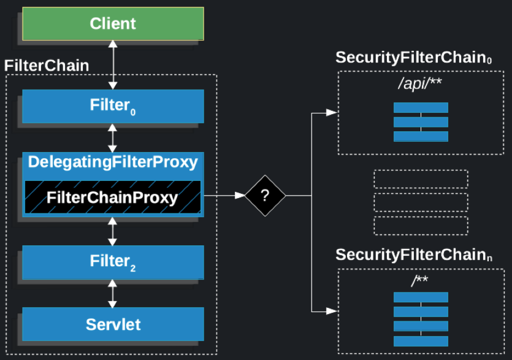
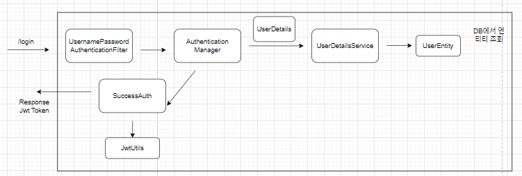

## 학습 정리

### 3장 Security Config 클래스 (STATELESS)
```java
@Configuration
@EnableWebSecurity
public class SecurityConfig {

  @Bean
  public SecurityFilterChain filterChain(HttpSecurity http) throws Exception {
       //..
    }
}
```
- @EnableWebSecurity를 하지 않으면?
  - 스프링 시큐리티가 제공하는 기본 설정을 사용
  - @EnableWebSecurity를 사용하고 `filterChain` 메서드를 커스터마이징 후 @Bean으로 등록하면 
스프링 시큐리티의 기본 설정은 무시되고 개발자가 커스터마이징한 설정이 적용

```java
        // csrf 비활성화
        http
                .csrf(AbstractHttpConfigurer::disable);
```
- csrf란?
  - Cross Site Request Forgery
  - 웹 어플리케이션 취약점 중 하나
  - 사용자가 인증된 상태에서(로그인한 상태) 사용자의 인증 쿠키를 이용해 의도하지 않은 요청을 보내어 공격자가 사용자의 권한을 이용하는 공격
  - csrf 토큰을 사용하여 방어
    - 서버는 클라이언트에게 토큰을 건네준다
    - 클라리언트는 GET을 제외한 form 형식의 요청에 csrf 토큰을 적재해서 보내준다
    - 서버는 csrf 토큰을 검증하여 요청을 처리한다. 적절하지 않은 csrf 토큰이면 403을 내려준다.
  - JWT 방식에서는 csrf disable 설정해도 괜찮음
    - JWT는 Authorization 헤더에 토큰을 적재해서 전송하기 때문에 csrf 공격에 취약하지 않음
    - JWT 토큰을 쿠키에 담아서 보내면 CSRF 공격에 취약할 수 있음

```java
        // form 로그인 방식 비활성화
        http
                .formLogin(AbstractHttpConfigurer::disable);
```
- form 로그인 비활성화
  - form 로그인 방식은 세션 기반 인증에서 사용된다.
  - 서버에서 인증 상태(세션)를 저장하지 않는 JWT 방식에서는 form 로그인 방식이 필요하지 않다.
  - 참고로 세션 방식을 사용할 경우 브라우저의 JESSION 쿠키에 세션 정보가 저장됨

```java
        // 세션 설정
        http
                .sessionManagement((session) -> session
                        .sessionCreationPolicy(SessionCreationPolicy.STATELESS)
                );
```
- 세션 비활성화
  - 세션 생성 정책을 STATELESS로 설정
  - JWT 방식을 사용하기 때문에 스프링 시큐리티에게 세션을 사용하지 않겠다고 지시
  - 따라서, **서버측 메모리에 세션을 저장하지 않아** 동일한 브라우저에서 요청하더라도 매번 새로운 사용자로 인식

### 5장 DB연결 및 Entity 작성
```java
spring.jpa.hibernate.naming.physical-strategy=org.hibernate.boot.model.naming.PhysicalNamingStrategyStandardImpl
```
- spring.jpa.hibernate.naming.physical-strategy
  - Hibernate의 테이블 이름, 칼럼 이름 등 DB의 물리적인 네이밍 전략을 설정하는 속성
  - PhysicalNamingStrategyStandardImpl은 별도의 변환을 수행 하지 않고 엔티티에 정의된 이름 그대로 DB 스키마에 반영
  - 기본 전략은 org.springframework.boot.orm.jpa.hibernate.SpringPhysicalNamingStrategy
    - 카멜케이스를 스네이크 케이슬 변환(소문자)

### 7장 로그인 필터 구현
- 필터
  - WAS와 서블릿 사이에 특정 처리를 수행하는 곳
  - HTTP 요청 -> WAS -> 필터1 -> 필터2 ... -> 서블릿 -> 컨트롤러
- DelegatingFilterProxy란?
  - 전통적인 서블릿 필터는 Spring IoC의 도움을 받을 수 없다.
  -  DelegatingFilterProxy는 이러한 한계를 극복하기 위해 만들어진 클래스
  - 서블릿 컨테이너의 필터 생명주기안에서 Spring의 FilterChainProxy 빈을 사용할 수 있다.
  - FilterChainProxy 빈을 찾은뒤 해당 빈에게 시큐리티 필터링 작업을 위임한다.
- FilterChainProxy
  - 스프링 시큐리티의 필터들을 관리하고 제어한다.(순서 제어 등)
  
---

- UsernamePasswordAuthenticationFilter
  - 세션의 formLogin 방식으로 했으면 자동으로 적용이 되었다.
  - 하지만 JWT 기반에서 formLogin을 disabled했기 때문에 기본적으로 활성화 되어 있는 UsernamePasswordAuthenticationFilter는 동작하지 않는다. 
  - 따라서 상속을 받아서 직접 구현을 해줘야 동작한다.
  - authenticationManager를 통해 인증을 진행할 수 있도록 토큰값을 만들어서 넘겨준다.
  - 로그인 성공시 실행하는 메서드인 `successfulAuthentication`와 로그인 실패시 실행하는 메서드인 `unsuccessfulAuthentication`를 오버라이딩 하여 구현할 수 있다. 
  - 기본 옵션
    - /login PATH 경로 
    - form-data, 필드값은 username, password 

  - PATH 경로를 수정하고 싶을 경우
  ```java
  LoginFilter loginFilter = new LoginFilter(authenticationManager(authenticationConfigutration), jwtUtil);
  loginFilter.setFilterProcessesUrl("경로설정");
  
  http
      .addFilterAt(loginFilter, UsernamePasswrodAuthenticationFilter.class);
  ```

※ 스프링 시큐리티는 모든 처리를 필터단에서 처리한다.

### 8장 DB기반 로그인 검증 로직
- LoginFilter의 authenticationManager.authenticate(authToken);가 UserDetailsService의 loadUserByUsername 메서드를 호출한다.
  - 하지만 UserDetailsService의 구현체는 단 하나여야 스프링 시큐리티가 찾을 수 있다. 
- loadUserByUsername 메서드는 username을 받아서 계정이 존재하면 UserDetails를 반환한다.
- 비밀번호 검증 로직은 따로 존재하지 않는데 어디서 진행하는 걸까?
  - AutheticationManager 구현체인 ProviderManager에서 AuthenticationProvider 타입을 합성으로 가진다.
  - AuthenticationProvider의 구현체인 DaoAuthenticationProvider에서 비밀번호 검증을 진행한다.
  - 즉, 사용자에게 받은 데이터와 DB에서 조회한 데이터를 검증하고 성공/실패를 판단하는 구현부분
  - DB에 암호화되어 저장되어 있다면 로그인시 입력되는 비밀번호는 DaoAuthenticationProvider에서 자동으로 암호화를 한다.

### 9장 JWT 발급 및 검증 클래스
- 사용한 암호화 알고리즘이 HS256이면 256비트(32byte)의 키값을 사용해야 한다.

### 10장 로그인 성공 JWT 발급
- 토큰을 보낼떄 "Bearer {토큰}" 형식으로 보내야 할까?
- HTTP 인증 방식은 RFC 7235 정의에 따라 아래 인증 헤더 형태를 가져야 한다.
```text
Authorization: 타입 인증토큰
```

- Bearer 인증 방식은 OAuth 2.0 프레임워크에서 사용하는 토큰 인증 방식이다.
- "Bearer"은 소유자라는 뜻으로, "이 토큰의 소유자에게 권한을 부여해줘" 라는 의미이다.
- Bearer 토큰은 OAuth 프레임워크에서 액세스 토큰으로 사용하는 토큰의 유형이다.
- 토큰의 형태는 JWT를 사용하기도 한다.
```text
//예시
Authorization: Bearer 인증토큰
```
 
- attemptAuthentication에선 UsernamePasswordAuthenticationToken을 생성시 principal에 username을 넣어줬다. 
- successfulAuthentication에서는 principal은 CustomUserDetails 형태로 존재한다
```java
    @Override
    public Authentication attemptAuthentication(HttpServletRequest request, HttpServletResponse response) throws AuthenticationException {
        //스프링 시큐리티에서 username과 password를 검증하기 위해서는 token에 담아야 함
        UsernamePasswordAuthenticationToken authToken = new UsernamePasswordAuthenticationToken(username, password, null);

        //token에 담은 검증을 위한 AuthenticationManager로 전달
        return authenticationManager.authenticate(authToken);
    }

@Override
protected void successfulAuthentication(HttpServletRequest request, HttpServletResponse response, FilterChain chain, Authentication authentication) {
        CustomUserDetails customUserDetails = (CustomUserDetails) authentication.getPrincipal();
```

- Authentication 인터페이스
```java
	 * @return the <code>Principal</code> being authenticated or the authenticated
	 * principal after authentication.
	 */
	Object getPrincipal();
```
- 인증 전에는 사용자 이읻, 인증 후에는 인증된 사용자 정보를 반환한다. 

### 11장 JWT 검증 필터
- JWTFilter에서 토큰을 검증하고 검증이 완료되면 SecurityContextHolder에 인증 정보(Authentication)를 등록한다.
  - 값을 담는 추가적인 이유는 이후 시큐리티 필터에서도 인증 정보를 사용하기 위함이다. 
- 이후 SecurityConfig에 등록한 requestMatchers를 검증하는 인가 필터가 동작하여 세션에서 해당 유저에 대한 role을 조회해서 접근 여부를 결정한다. 
```java
        //UserDetails에 회원 정보 객체 담기
        CustomUserDetails customUserDetails = new CustomUserDetails(userEntity);

        //스프링 시큐리티 인증 토큰 생성
        Authentication authToken = new UsernamePasswordAuthenticationToken(customUserDetails, null, customUserDetails.getAuthorities());
        //세션에 사용자 등록
        SecurityContextHolder.getContext().setAuthentication(authToken);
```

```java
        http
                .authorizeRequests((auth) -> auth
                        .requestMatchers("/login", "/", "/join").permitAll()
                        .requestMatchers("/admin").hasRole("ADMIN")
                        .anyRequest().authenticated()
                );
```

- SecurityContextHolder에 생성되는 세션이 STATELESS한 이유는 SecurityConfig에서 세션을 STATELESS로 설정했기 때문이다.
```java
        // 세션 설정
        http
                .sessionManagement((session) -> session
                        .sessionCreationPolicy(SessionCreationPolicy.STATELESS)
                );
```
- SecurityFilterChain에 대한 세션 설정은 해당 SecurityFilterChain 범위에서만 적용된다
- SecurityFilterChain 내부에 속해 있는 SecurityContextHolderFilter가 세션 관리를 진행하기 때문이다.
- 따라서 다중 SecurityFilterChain 설정시 모든 필터에 대해서 각각 STATELESS 설정을 진행해야 합니다.
```java
   @Override
    protected void configure(HttpSecurity http) throws Exception {
        http
            .antMatcher("/api/**")  // 첫 번째 필터 체인: API 경로
                .authorizeRequests()
                .anyRequest().hasRole("API_USER")
                .and()
            .httpBasic()
            .and()
            .sessionManagement()
            .sessionCreationPolicy(SessionCreationPolicy.STATELESS);

        http
            .antMatcher("/admin/**")  // 두 번째 필터 체인: 관리자 경로
                .authorizeRequests()
                .anyRequest().hasRole("ADMIN")
                .and()
            .formLogin()
            .and()
            .sessionManagement()
            .sessionCreationPolicy(SessionCreationPolicy.IF_REQUIRED);
    }
```

- 컨틀로러 단에서 인증 정보를 가져오는 방법
```java
    @GetMapping("/user")
    public ResponseEntity<UserEntity> getUserInfo(@AuthenticationPrincipal CustomUserDetails customUserDetails) {
        return ResponseEntity.ok(customUserDetails.getUserEntity());
    }
```
- 인증이 완료된 사용자 정보를 가져오는 방법
```java
    @GetMapping("/user")
    public ResponseEntity<UserEntity> getUserInfo() {
        CustomUserDetails principal = (CustomUserDetails) SecurityContextHolder.getContext().getAuthentication().getPrincipal();
        return ResponseEntity.ok(principal.getUserEntity());
    }
``` 

- JWTFilter에서 토큰을 받고 세션을 만든 후 LoginFilter 필터를 통과하지만 attemptAuthentication() 메서드는 동작하지 않는다.
- LoginFilter는 LoginFilter <- UsernamePasswordAuthenticationFilter <- AbstractAuthenticationProcessingFilter 구조를 가진다
- AbstractAuthenticationProcessingFilter 내부의 doFilter() 메서드가 /login 경로인지 체크한다. (세션 유무 검증은 X)
  - 따라서, JWT를 가지고 /login 경로로 접근하는 유저는 UsernamePasswordAuthenticationFilter에서 막는 로직이 필요하다.
  
- OncePerRequestFilter란?
  - 스프링의 서블릿 필터 중 하나로, 한 요청에 대해 한 번만 실행되도록 보장하는 필터다.
  - 예를 들어, 하나의 요청안에서 url 포워딩을 시키면 다시 요청을 하는 셈인데, 이때 필터가 두 번 실행되는것을 방지한다.
  - 인증, 인가와 같이 한번만 거쳐도 되는 필터에 사용된다.

### 13장 CORS 설정
- 스프링 시큐리티 설정과 WebMVc 설정 둘다 cors를 처리해줘야 한다.
  - WebMVc: 컨트롤러를 통해서 들어오는 요청
  - 시큐리티에 필터단 까지만(/login) 들어오고 나가는 요청  

### 14장 JWT의 목표

- JWT의 STATELESS
  - JWT 구현을 위해 Spring Security에서 STATELESS가 필요하지만 STATELESS에 집착할 필요는 없다.
- 토큰 탈취 문제
  - 토큰이 탈취당하면 보안에 취약하다.
  - 따라서 Refresh, Access 토큰을 나누어 사용하는데, Refresh 토큰 요청은 주기가 길기 때문에 탈취 당할 확률은 낮지만(네트워크 많이 안탐) 탈취 당할 수도 있다.
  - 토큰이 탈취당하면 만료기간 전까지 서버측은 보안에 위험하다.
  - 최악의 상황으로 서버 비밀키를 변경해야 한다.
  - 프론트에서 로그아웃을 구현해도 서버측에서는 토큰이 만료되기 전까지는 탈취된 토큰을 사용할 수 있다.
  - Redis 혹은 DB에 refresh 토큰을 저장하고, 로그아웃 하거나 탈취된 토큰은 블랙리스트 등록, 혹은 제거하여 access 토큰 발급이 불가능 하도록 할 수 있다. 
- STATELESS인데 저장소에 저장?
  - STATELESS한데 저장소에 refresh 토큰을 저장한다는데 모순아닌가?
  - 그럼 차라리 세션 방식을 도입하여 클러스터링을 하는게 더 좋지 않을까?
- IP 검증? -> 실패
  - 처음 로그인 요청된 IP를 기억하고 있다가 요청이 올때마다 IP를 검증하는 방법
  - 하지만, 사용자 단말기의 IP는 동적으로 자주 변경되기 때문에 문제가 된다.
- JWT를 왜 사용하는가?
  - JWT의 STATELESS한 상태에만 목적을 두지말고 JWT 자체가 왜 필요한지 생각해보자
  - 모바일앱
    - JWT가 각광받게 된 이유는 모바일 앱의 등장
    - 앱의 특성상 세션 방식을 사용하긴 제한이 크다.
    - 이러한 과정에서 STATELESS는 부수적인 효과
  - 모바일앱에서의 로그아웃
    - 앱에서는 JWT 탈취 우려가 거의 없다.
      - 웹은 소스코드, 요청 URL, 쿠키, 헤더를 쉽게 확인할 수 있다.
      - 앱은 확인하기 어렵다.
    - 앱단에서 로그아웃을 진행하여 JWT 자체를 제거해버리면 서버측에선 조치가 필요 없다.
    - 이러한 과정에서 STATELESS는 부수적인 효과 
  - 장시간 로그인과 세션
    - 세션 방식의 경우 장시간 로그인 상태를 유지하려면 서버측 부하가 많이간다.
- 결론은 JWT 목적이 STATELESS가 아닌 모바일 앱에서의 편의성이 크다는 것이다.


